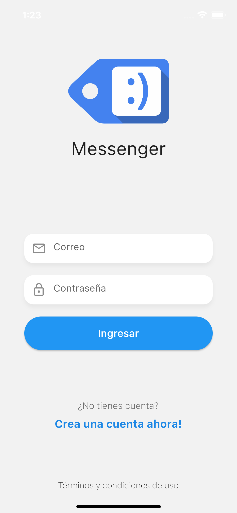

# Flutter Avanzado: Lleva tu conocimiento al siguiente nivel

## Messenger App
Messenger app real time chats, working with NodeJS (socket.io), MongoDB, etc.

Udemy curse by: [Fernando Herrera](https://fernando-herrera.com/#/)

previus SECTIONS:
1(intro)-2-3-4-5   ✅ 

- [Bands App](https://github.com/JimHuertas/bands-flutter-app)
- [Bands App Server](https://github.com/JimHuertas/01-bands-names-server)

MODULES: \
6   ✅ \
7   🚫 \
8   🚫 \
10  🚫 \
11  🚫

 

# Feedback

Learning backend with NodeJS on Flutter.
Requirements:
- Flutter (this project)
- Postman (test requests)
- MongoDB Compass
- NodeJS (nodemon: 'sudo npm i -g nodemon' )

## Modules (6)

### 02 - Messenger App

#### YAML Flutter:
- cupertino_icons: ^1.0.2 (views for IOS)
- socket_io_client: ^2.0.0
- provider: ^6.0.3 (listeners when detected a change in its model origin, do changes in real time on views)
